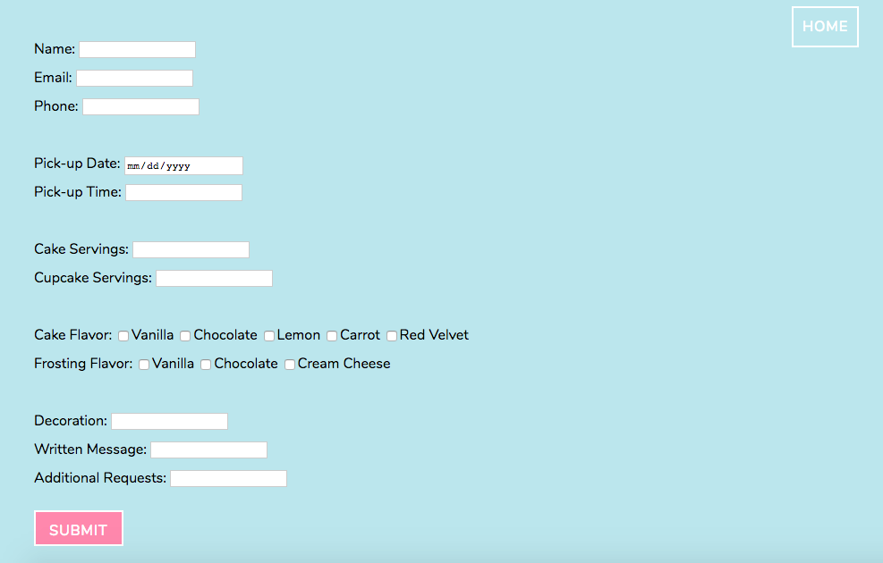
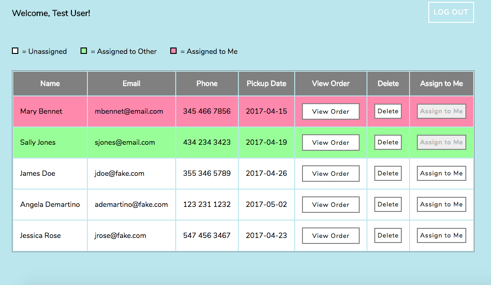

# Bakery Order Processing & Tracking

An app that allows bakery owners to receive orders from clients and store them in an easily accessible database. Bakery owners and their employees can create separate accounts and view the list of pending orders, knowing quickly if an order is assigned to the account holder, another baker, or pending assignment. Order details can be accessed from the dashboard, and orders can be deleted as they are completed.

[View live app.](https://epitrack.netlify.com/)

To access the dashboard, use [username: testuser1, password: password1]

Technology Used: HTML, CSS, JavaScript, jQuery, Node.js, Mongoose, Express

## Known limitations
App uses Basic auth strategy which forces the browser to show an auth popup when credentials are invalid. 